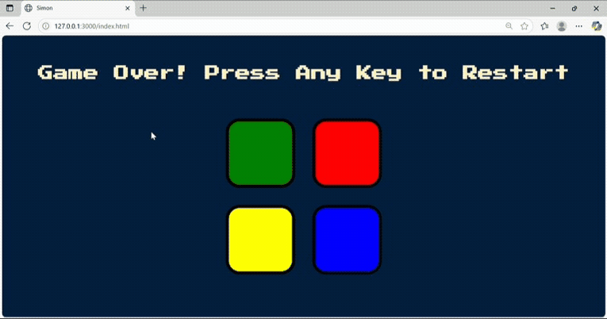

# Simon Game 🎮

[](https://www.ecma-international.org/ecma-262/6.0/)
[](https://jquery.com/)
[](https://www.w3.org/Style/CSS/)
[](https://html.spec.whatwg.org/)

A modern implementation of the classic Simon electronic memory game, built with clean code principles and professional software development practices.



## 🚀 Features

- **Interactive Gameplay**: Engaging user interface with smooth animations and sound effects
- **Progressive Difficulty**: Automatically increasing challenge as players advance
- **Responsive Design**: Fully playable across different screen sizes
- **Modern Architecture**: Built with ES6+ JavaScript features
- **Professional Code Structure**: Organized, well-documented, and maintainable codebase

## 🛠️ Technical Stack

- **Frontend Framework**: Vanilla JavaScript with jQuery
- **Styling**: Custom CSS3 with modern flexbox layout
- **Audio**: Web Audio API for game sounds
- **Font**: Google Fonts integration
- **Version Control**: Git

## 💻 Code Quality

- Strict mode enforcement for better error catching
- Consistent code style and formatting
- Comprehensive JSDoc documentation
- Modern ES6+ features (const/let, template literals)
- Clean and semantic HTML5 structure
- Efficient DOM manipulation with jQuery
- Responsive and maintainable CSS

## 🎯 Implementation Highlights

```javascript
/**
 * Generates the next color in the sequence and updates the UI.
 * Demonstrates modern JavaScript practices and clean code principles.
 */
function nextSequence() {
    level++;
    $("#level-title").text(`Level ${level}`);
    const randomNumber = Math.floor(Math.random() * buttonColours.length);
    const randomChosenColour = buttonColours[randomNumber];
    gamePattern.push(randomChosenColour);
    $(`#${randomChosenColour}`).fadeOut(100).fadeIn(100).fadeOut(100).fadeIn(100);
}
```

## 🎮 How to Play

1. Open `index.html` in a modern web browser
2. Press any key to start the game
3. Watch and memorize the sequence of colored buttons
4. Repeat the sequence by clicking the buttons in the correct order
5. Each successful round adds one more step to the sequence
6. Make a mistake, and the game starts over!

## 🚀 Getting Started

```bash
# Clone the repository
git clone https://github.com/ogidy/Simon_game.git

# Navigate to the project directory
cd Simon_game

# Open in your browser
open index.html  # (Mac)
# or
start index.html # (Windows)
```

## 📐 Project Structure

```
Simon_game/
├── index.html          # Main HTML structure
├── styles.css         # Custom styling
├── game.js           # Game logic and interactions
└── sounds/           # Audio files for game feedback
    ├── blue.mp3
    ├── green.mp3
    ├── red.mp3
    ├── wrong.mp3
    └── yellow.mp3
```

## 🧪 Testing

The game has been thoroughly tested across multiple browsers and devices to ensure consistent functionality and user experience.

## 🤝 Contributing

Contributions are welcome! Please feel free to submit a Pull Request.

## 📝 License

This project is open source and available under the [MIT License](LICENSE).

## 👨‍💻 Developer

Developed by [Dr. Gideon Mensah](https://github.com/ogidy) - A pharmacist and passionate frontend developer focused on creating clean, efficient, and user-friendly web applications.

---

⭐ If you find this project interesting, please consider giving it a star!
